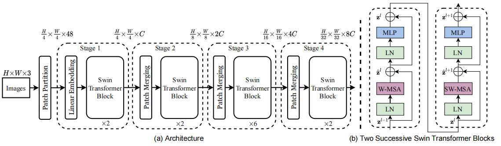
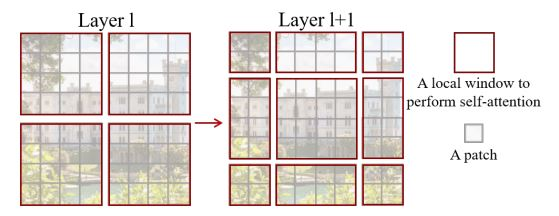
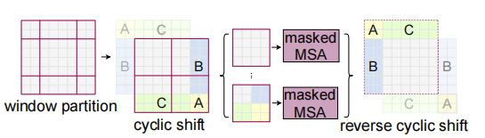
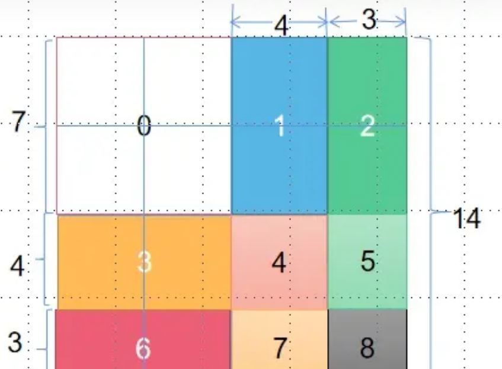
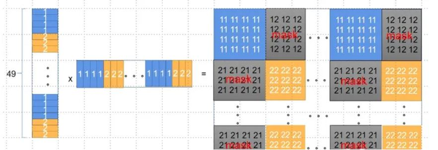

# 1.1.4 Transformer

在上一篇文章中，我们了解到注意力机制在深度学习模型中无处不在。注意力机制有助于提高机器翻译的准确性。在这篇文章中，我们将学习Transformer方法，一个利用注意力来提升模型训练速度的机制。Transformer在特定任务中优于谷歌机器翻译模型。然而，最大的好处得益于Transformer的并行能力。事实上，谷歌云建议使用Cloud TPU提供的Transformer作为参考模型。因此，接下来我们对模型以及其相应模块进行分析。

Transformer是在论文《 Attention is All You Need》中提出的。TensorFlow对应的实现可以使用Tensor2Tensor库提供的接口。在这篇文章中，我们将尝试简化理解，并逐一介绍概念，希望使没有相应基础的同学更容易理解。

## 1.1.4.1 基本流程

首先将模型视为单个黑盒。如下图1所示，在机器翻译应用程序中，输入一种语言的句子，然后输出另一种语言的翻译。

<div align=center>

</div>
<div align=center>图1. 翻译视作盲盒</div>

一个典型的Transformer模型如下图2所示，作为seq2seq模型，它也分为编码和译码两个阶段，两个阶段都由一系列Transformer模块堆叠而成，注意这些模块是不共享权重的，以原论文为例则分别为编码和译码各堆叠了6个Transformer模块。

<div align=center>

</div>
<div align=center>图2. 典型的Transformer模型</div>

Transformer的编码器和解码器结构如下图3所示，编码器由自注意模块（Self-Attention）和前馈网络（Feed Forward Neural Network, FFNN）组成；解码器则与编码器类似，但在自注意模块和前馈网络中间由插入了一层编解码器注意力模块（也叫Cross-Attention，该模块与前述RNN中的上下文注意力类似）。

<div align=center>

</div>
<div align=center>图3. Transformer的编码器和解码器结构</div>

具体执行过程：

（1）首先将输入文本转换为词向量，并且融合位置编码，输入给第一个编码器；

（2）第一个编码器，结合上下文，对每个词向量进行编码，分别得到相同数量的向量作为下一个编码器的输入（输出向量的长度是一个可设定的超参）；编码器依次连接，对编码阶段最终输出的向量按照注意力机制，分别转换成K向量和V向量，K和V分别表示每个每个单词编码后的键（Key）和值（Value），这两套向量将用于解码阶段的编解码注意力模块；

（3）解码器的工作与编码器类似，首先输入一个代表“起始”的token（记为&lt;s&gt;），然后经过层层解码最后转换为一个分类问题用全连接和softmax输出单词的概率分布；

（4）然后将&lt;s&gt;和第一个单词拼接，作为解码阶段的新输入（与编码阶段的输入类似，需要经过词向量的转换和位置编码的融合），进而输出第二个单词的概率分布……以此类推，直到最终输出代表“结束”的token（记为&lt;eos&gt;）。

## 1.1.4.2 自注意模块

首先，对每个词向量（或经过若干次编/解码后得到的特征向量）进行处理，分别产生查询向量（Query）、键向量（Key）和值向量（Value），这三个向量的长度是相同的，并且该长度是可设置的超参。为了产生这三个向量，我们需要模块提供三个可训练的权重，通过权重矩阵与词向量（或特征向量）的乘法得到。

不妨用Python的“字典（Dict）”来类比这三个向量的作用（一种模糊映射关系）

```
Dict[Key] = Value     # Key-Value是实际映射关系中的键值对,
Value_ = Dict[Query]  # 用Query去匹配Key以查询Value，
# 在Python的Dict中Query和Key是精确配对的；
# 但在自注意模块中，是用Query去模糊匹配Key并提取出模糊的Value_
```

<div align=center>

</div>
<div align=center>图4. QKV计算过程 </div>

当每个词向量（或特征向量）都有了对应的查询向量、键向量和值向量之后，就可以进行如下的自注意力机
制。比如计算第一个词向量（对应单词Thinking）的特征向量:

1. 用该单词的查询向量 $q_1$ 与所有单词对应的键向量 $q_1,q_2,q_3,...q_n$ 做点乘，分别得到每个单词的查询得分 $s_1,s_2,s_3,...s_n$ ；
2. 用 $\sqrt{d_k}$ 规范化得分（ $d_k$ 代表查询向量的长度），并将规范化后的得分作为一个向量执行 $softmax$ 作为权重；
3. 利用得到的权重加权求和，即为该词向量对应的输出向量。

对应示例如下图5所示：

<div align=center>

</div>
<div align=center>图5. 自注意力机制过程 </div>

将所有输入的词向量堆叠成矩阵，则可以简写成如下的矩阵形式：

<div align=center>

</div>
<div align=center>图6. 自注意力机制矩阵表示 </div>

## 1.1.4.3 多头设计（Multi-heads）

前述自注意模块中，对于每个输入向量，只产生一个对应的特征向量，而多头设计即是希望对每个输入向量能产生多个不同的特征向量（与CNN中特征图的“通道”类似）。实现上也不麻烦，只需要设置多套不共享的权重矩阵 $W^q, W^k, W^v$ 即可。这样做有两点好处:

(1) 使模型能更好的将注意力放在多个不同的位置上；

(2) 使注意力模块能拥有更复杂的表示子空间（representation subspaces）;

<div align=center>

</div>
<div align=center>图7. 多头注意力 </div>

为了融合多头提取的特征向量，FFNN也要做出相应的调整，将这些特征向量进行拼接，同时扩大$W^O$权重矩阵的规模。

<div align=center>

</div>
<div align=center>图8. 特征拼接 </div>

完整的多头设计的Transformer编码器如下图9所示，

<div align=center>

</div>
<div align=center>图9. Transformer编码器 </div>

## 1.1.4.4 位置编码

Transformer抛弃了天然具有位置信息的RNN，便丢失了序列本身的位置信息（比如一个单词在句子中的位置），因此需要借助其他手段来加强输入的数据，以引入位置信息。这里Transformer采用的是一种位置编码（Positional Encoding）的技术。用一个与词向量长度相等的向量表示其所在的位置（或次序），并与词向量逐元素相加，从而将位置信息编码到词向量。

<div align=center>

</div>
<div align=center>图10. 位置编码 </div>

论文采用如下的位置编码方案：

$$
PE_t^{(i)}=
\begin{cases} 
sin(w_k\cdot{t}), i = 2k \\
cos(w_k\cdot{t}), i = 2k+1
\end{cases}
$$


$$
w_k = \frac{1}{10000^{2i/d}}
$$

其中， $PE_t^{(i)}$ 表示第 $t$ 个时间步的位置编码向量的第 $i$ 个元素； $d$ 是位置编码向量的长度，也即词向量的长度。

定义中，三角函数的频率沿着维度逐渐减小，波长形成了 $2\pi$ 到 $10000\cdot{2\pi}$ 的几何级数。

该编码方案的优点如下：
1. 对于每个时间步，其位置编码向量都是独一无二的；
2. 编码向量只取决于时间步的序号，与序列长度无关，能够适用于任意长度的序列；
3. 编码的数值是有界的；
4. 编码方式是确定的；
5. 模型更容易关注到相对位置信息, 因为对于任意偏移量 $k$, $PE_{t+k}$ 和 $PE_t$ 都满足一定的线性关系，也即存在某个矩阵 $T^{(k)}$ 可以使 $PE_{t+k}$ = $T^{(k)}\cdot{PE_t}$

## 1.1.4.5 残差设计

与ResNet类似，Transformer也为编码器和解码器引入了残差结构。

<div align=center>

</div>
<div align=center>图11. 残差设计 </div>

无论是自注意模块，还是前馈神经网络、编解码注意力模块，均加入了短连接设计和Normalize，但注意在序列任务中通常是不使用BN的，像论文中就使用了LN来进行规范化。

## 1.1.4.6 贪心解码&束搜索

与CNN等不同，RNN和Transformer在产生一个新的输出时都与先前的输出的有关，因此在产生完整的输出时会有不同的方案。

最简单的方案是贪心解码（Greedy Decoding），也即每次选取概率最高的一项作为新的输出；

复杂点的方案则是束搜索（Beam Search），每次选取概率较高的$k$个候选项，分别假设本次输出是某一候选项来预测下一输出（共 $k*k$ 个），然后从中选取概率较高的 $k$ 个作为新的候选项，以此类推，预测的代价将是贪心解码的 $k$ 倍，但也更为合理和准确。

## 1.1.4.7 vision in transformer

transformer的体系结构最早是作为自然语言处理任务的实际标准出现的，但它在计算机视觉中的应用一直到论文《AN IMAGE IS WORTH 16X16 WORDS:TRANSFORMERS FOR IMAGE RECOGNITION AT SCALE》在ICLR2021发表并提出vision in transformer即VIT后才得以广泛应用。本节简单介绍VIT的架构。

下图将VIT的结构分成5个部分：

<div align=center>

</div>
<div align=center>图12. vision in transformer </div>

第一部分是将输入的图像进行patch的划分。例如输入图像维度是224×224×3，将图像分成16×16的patch(小方块)，每个patch块可以看做是一个token(词向量)，共有（224/16=14）14×14=196个token，每个token的维度为16×16×3=768，这里patch块大小是16×16，×3则是代表每个patch块是RGB三通道的彩色图像。

第二部分是将patch拉平，经过线性映射得到结果。一个patch块的维度是16×16×3=768，把它拉平成行向量它的长度就为768，一共有14×14=196个patch，所以输入的维度是[196, 768]，经过一个线性映射到指定的维度，比如1024或2048，用全连接层来实现，但映射的维度仍然选择为768，那么此时的输出是[196, 768]。在原文里整个过程称作patch embedding，也就意味着patch embedding的维度为[196, 768]。

第三部分是patch+位置信息编码(原文记作position embedding)。首先生成一个cls token，它的维度为[1, 768]，然后拼接到输入的path embedding，得到的维度为[197, 768]。cls即class，用于对编码向量进行分类。然后对197个patch都生成一个位置信息编码，它的维度同patch维度为[197, 768]，最后patch和位置信息编码直接相加为新的token作为encoder的输入。cls token和位置信息编码是随机生成的可学习参数，可以全零初始化，也可以0-1随机初始化。cls token的作用是为了同NLP领域的Transformer保持一致，最后直接提取cls token作为网络提取得到的特征，作为类别预测的输出，放入MLP进行分类。

第四部分是transformer encoder的结构，类同于上文所讲的transformer架构。

第五部分是MLP分类。整个Encoder的输出为[197, 768]，仅保留最前面的CLS token作为全连接的输入[1, 768]，然后接上全连接层及分类数n_class，使用交叉熵损失函数计算损失，反向传播更新网络的权重和参数。

## 1.1.4.8 swin-transformer

随着VIT及多头注意力机制在计算机视觉领域的广泛使用，研究者也不断对其架构作出创新以达到更好的任务效果。一个著名的成果就是swin-transformer，发表于cvpr2021的《Swin Transformer: Hierarchical Vision Transformer using Shifted Windows》，由于其亮眼的表现已成为当今视觉模型架构的主干。本节简单介绍swin-transformer架构。

首先，VIT应用到图像领域主要有两大挑战：视觉实体变化大，在不同场景下视觉Transformer性能未必很好；图像分辨率高，像素点多，Transformer基于全局自注意力的计算导致计算量较大。针对上述两个问题，原文提出了一种滑动窗口注意力机制（shifted window attention）。 事实上，Swin Transformer 的名字来源于“Shifted window Transformer”。将注意力计算限制在一个窗口中，一方面能引入CNN卷积操作的局部性，另一方面能节省计算量。下图为swin-transformer的整体架构。

<div align=center>

</div>
<div align=center>图13. swin-transformer </div>

整个模型采取层次化的设计，一共包含4个Stage，每个stage都会缩小输入特征图的分辨率，像CNN一样逐层扩大感受野。在输入开始的时候，做了一个Patch Embedding，将图片切成一个个图块，并嵌入到Embedding。在每个Stage里，由Patch Merging和多个Block组成。其中Patch Merging模块主要在每个Stage一开始降低图片分辨率。

其中有几个地方处理方法与ViT不同：
- ViT在输入会给embedding进行位置编码。而swin-transformer这里则是作为一个可选项（self.ape），swin-transformer是在计算注意力的时候做了一个相对位置编码。
- ViT会单独加上一个可学习的位置信息编码，作为分类的token。而swin-transformer则是直接做平均，输出分类，有点类似CNN最后的全局平均池化层。

滑动窗口注意力是swin-transformer的关键。传统的transformer都是基于全局来计算注意力的，因此计算复杂度十分高。而swin transformer则将注意力的计算限制在每个窗口内，进而减少了计算量。下图是滑动窗口注意力机制简图。

<div align=center>

</div>
<div align=center>图14. 滑动窗口注意力 </div>

上图右图是左图向右下方移动半个窗口得到，这么做的原因是为了提取跨窗口的信息。这样做又带来新的问题，之前是4个窗口，且每个窗口大小一致，但是现在是9个窗口，且每个窗口大小不一致，计算上不能批量计算。于是原文提出了cyclic shift，下图是cyclic shift操作过程。

<div align=center>

</div>
<div align=center>图15. cyclic shift </div>

上图第一步先把最上面一行的三个窗口移动到最下面，再把最左边三个窗口移动到最右边，得到cyclic shift，这样cyclic shift中就只有四个窗口了，且四个窗口大小相同，这样就可以进行批量处理了。但是把原本不相干的部分放在了一起，是我们不希望看到的。于是原文又进行了mask操作。

<div align=center>

</div>
<div align=center>图16. mask操作(1) </div>

以上图右上角序列为1和2的块组成的窗口为例进行说明，12代表索引，则窗口长为7，其中元素索引组成的序列为11112221111222 ...1111222，那么做自注意力点乘就如下图所示。其中蓝色和黄色部分是我们要留下的，灰色部分是不要的，需要mask掉，具体做法是加上一个维度一样的矩阵，其中蓝色和黄色部分设为0，灰色部分都设成-100，加完后蓝色和黄色不变，而灰色部分接近-100。这样灰色部分再进行softmax时候就几乎为0了。

<div align=center>

</div>
<div align=center>图17. mask操作(2) </div>

这样就讲完了Swin Transformer的结构，最主要的就是它的层次性和局部性，论文的各种操作都是基于这两点提出的。在分类，检测，分割任务上都取得了SOTA的效果。